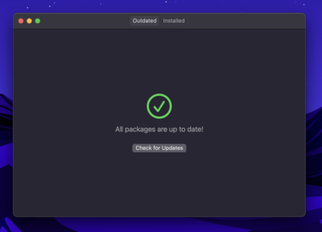

# BrewBar

A simple menu bar app for macOS that monitors your [Homebrew](https://brew.sh/)
packages for updates. It sits in your menu bar and checks for outdated packages
on a schedule you define.

> [!NOTE]
> BrewBar is a small personal project. It is usable, but it is not notarized by
> Apple and is still evolving.

## Features

- 🔍 Check for outdated Homebrew packages on a customizable schedule
- 🔔 Notifications when updates are available
- 🖱️ Selective package updates - choose which packages to upgrade
- 🚀 One-click updates for individual packages or all at once
- ⚙️ Settings for check intervals, login item behavior, notifications, and Homebrew commands
- 📋 Browse installed packages, inspect package info, and uninstall packages with confirmation
- 💻 Embedded terminal emulator using [SwiftTerm](https://github.com/migueldeicaza/SwiftTerm), with configurable light/dark appearance and color presets

## Screenshots

<div align="center">
  
  <p><em>Main menu showing outdated packages</em></p>

  
  <p><em>Package information and upgrade options</em></p>

  
  <p><em>Browse and uninstall installed packages</em></p>

  
  <p><em>Running an upgrade of all packages</em></p>

  
  <p><em>All packages are up to date</em></p>
</div>

## Installation

```shell
brew tap joshbeard/brewbar
brew install --cask brewbar
```

Alternatively, you can download directly from [releases](https://github.com/joshbeard/BrewBar/releases).

**NOTE:** This is not notarized by Apple. You may need to run `xattr -d com.apple.quarantine /Applications/BrewBar.app` if you get a warning that the application is corrupted.

## Development

```shell
make build
make release
```

### Pre-prod builds from CI

Non-tag workflow runs (for example pushes to `main`, pull requests, or a manual
[workflow run](https://github.com/joshbeard/BrewBar/actions)) upload a single
artifact named `BrewBar-dev-<git-sha>-<run-number>` containing `BrewBar.zip`,
`BrewBar.dmg`, and `brewbar.rb`. In GitHub, open **Actions**, select the run,
then **Artifacts** to download. Those artifacts use a 90-day retention window
set in the workflow.

Local notification permission requires a validly signed app. Local builds use an
Apple Development signing identity when one is available; otherwise they fall
back to ad hoc signing, which may prevent macOS from granting notification
permission.

## License

[MIT License](LICENSE)
