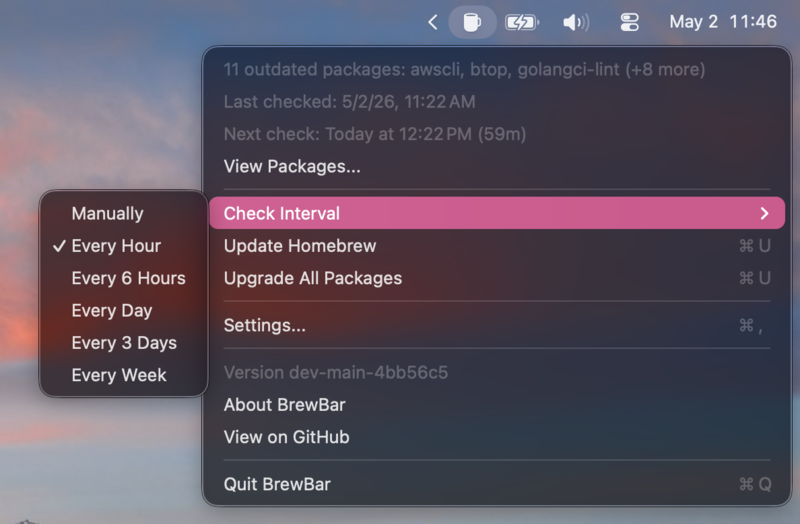
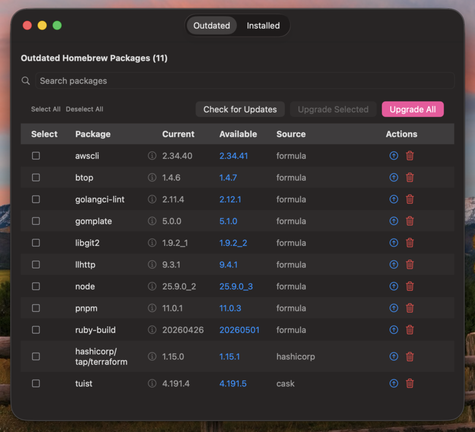
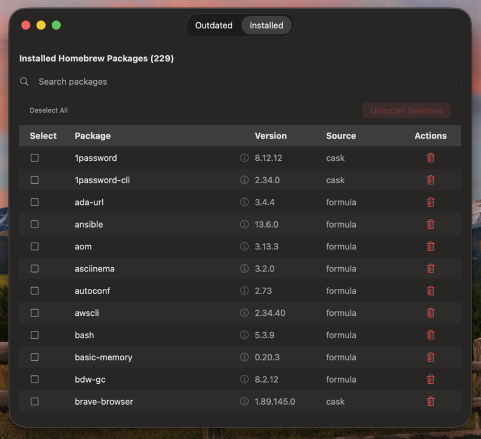
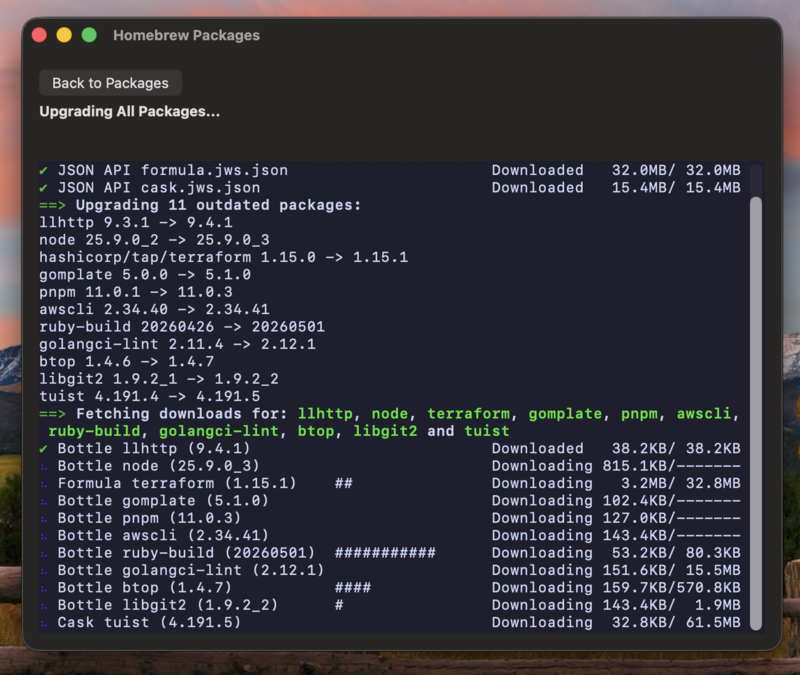

# BrewBar

A simple menu bar app for macOS that monitors your [Homebrew](https://brew.sh/)
packages for updates. It sits in your menu bar and checks for outdated packages
on a schedule you define.

## Features

- 🔍 Check for outdated Homebrew packages on a customizable schedule
- 🔔 Notifications when updates are available
- 🖱️ Selective package updates - choose which packages to upgrade
- 🚀 One-click updates for individual packages or all at once
- ⚙️ Settings for check intervals, login item behavior, notifications, and Homebrew commands
- 📋 Browse installed packages, inspect package info, and uninstall packages with confirmation
- 💻 Embedded terminal emulator using [SwiftTerm](https://github.com/migueldeicaza/SwiftTerm), with configurable light/dark appearance and color presets

## Screenshots

<table>
  <tr>
    <td align="center" valign="top" width="50%">
      <br/>
      <sub><i>Main menu showing outdated packages</i></sub>
    </td>
    <td align="center" valign="top" width="50%">
      <br/>
      <sub><i>Package information and upgrade options</i></sub>
    </td>
  </tr>
  <tr>
    <td align="center" valign="top" width="50%">
      <br/>
      <sub><i>Browse and uninstall installed packages</i></sub>
    </td>
    <td align="center" valign="top" width="50%">
      <br/>
      <sub><i>Running an upgrade of all packages</i></sub>
    </td>
  </tr>
</table>

## Installation

```shell
brew tap joshbeard/brewbar
brew install --cask brewbar
```

Alternatively, you can download directly from [releases](https://github.com/joshbeard/BrewBar/releases).

> [!IMPORTANT]
> BrewBar is **not notarized** by Apple, so Gatekeeper may refuse to open it or claim the app is damaged. If that happens, clear the quarantine attribute:
>
> ```shell
> xattr -d com.apple.quarantine /Applications/BrewBar.app
> ```

## Development

<details>
<summary>Building from source</summary>

```shell
make build
make release
```

Local notification permission requires a validly signed app. Local builds use an
Apple Development signing identity when one is available; otherwise they fall
back to ad hoc signing, which may prevent macOS from granting notification
permission.

</details>

## License

[MIT License](LICENSE)
