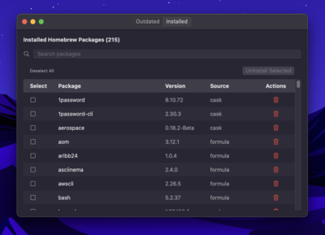
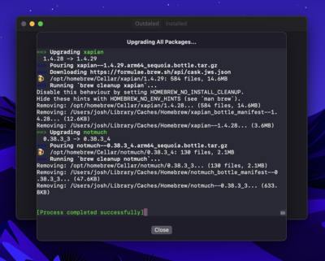

# BrewBar

A simple menu bar app for macOS that monitors your Homebrew packages for
updates. It sits in your menu bar and checks for outdated packages on a schedule
you define.

## Features

- 🔍 Check for outdated Homebrew packages on a customizable schedule
- 🔔 Notifications when updates are available
- 🖱️ Selective package updates - choose which packages to upgrade
- 🚀 One-click updates for individual packages or all at once
- ⚙️ Customizable update intervals, including user-defined schedules

## Screenshots

<div align="center">
  
  <p><em>Main menu showing outdated packages</em></p>

  
  <p><em>Package information and update options</em></p>

  
  <p><em>Settings and preferences</em></p>

  
  <p><em>Update notification example</em></p>
</div>

## Installation

```shell
brew tap joshbeard/brewbar
brew install --cask brewbar
```

Alternatively, you can download directly from [releases](https://github.com/joshbeard/BrewBar/releases).

## Disclaimer

This was mostly generated by LLM (many prompts to fine-tune). It's reviewed by
the author, but no major refactoring was manually done.

## License

[MIT License](LICENSE)